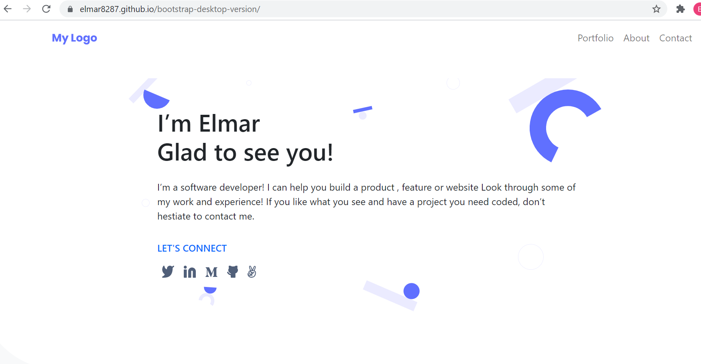

# Portfolio: Portfolio detail information Popup Window

> Add popup window. We used here the js objects.

## Built With

- HTML/CSS/Bootstrap
- Figma
- Java Script

## Authors

👤 **Elmar Abdulkarimov**

- GitHub: [@elmar8287](https://github.com/elmar8287)

👤 **Damilare Akintoye**

- GitHub: [@dami1080](https://github.com/dami1080)

## Live demo
You can visit live version via [link](https://elmar8287.github.io/bootstrap-desktop-version/)

## 🤝 Contributing

Contributions, issues, and feature requests are welcome!

Feel free to check the [issues page](../../issues/).

## Show your support

Give a ⭐️ if you like this project!
